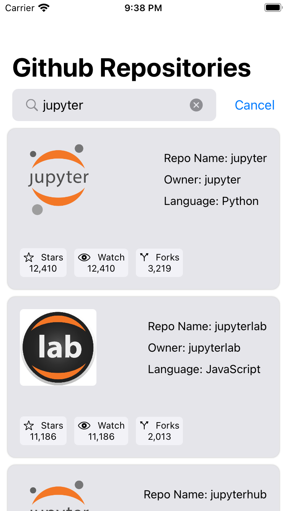

# <u>Github Repositories</u>
* The app is made using SwiftUI and Combine.
* The app is following MVVM architecture.
* There is no 3rd party library being used in this project.

### <u>Note about API</u> 
* GET /search/repositories has rate limit of 10 requests.
* Search results cannot be seen when rate limit has reached, it is recommended to let the cool down happen and try after a few seconds again.

## <u>App Screenshots</u>

	
	
    	
    
    
    

